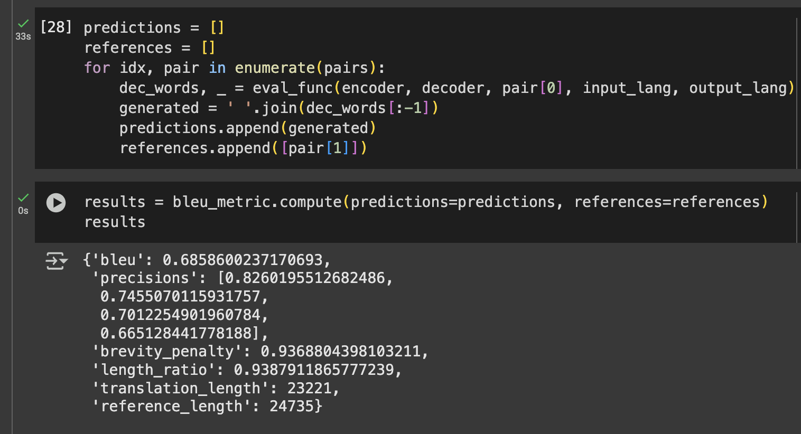

Trained on just available 3509 turkmen-english sentence pairs

We have DotProductAttention, GeneralAttention, and ConcatAttention(BahdanauAttention) 
implemented in the `models/attentions.py` file.

It's results on training data for now we have small amount of data: (on colab)




### Clean File Architecture
Below is a new (for me) structured directory layout for a Seq2Seq project with attention mechanisms, 
suitable for translation tasks. This structure includes directories for data, models, training scripts, 
configurations, logs, notebooks, and tests.

```
seq2seq_attention_project/
├── data/
│   ├── __init__.py
│   ├── dataset.py          # Data loading and preprocessing logic
│   └── vocab.py            # Vocabulary indexing/tokenization logic
│
├── models/
│   ├── __init__.py
│   ├── attentions.py    # Attention mechanisms (e.g., Bahdanau, Luong)
│   ├── encoder.py
│   ├── decoder.py
│   └── seq2seq.py       
│
├── config/
│   ├── __init__.py
│   └── config.yaml         # Model & training hyperparameters
│
├── experiments/
│   └── baseline_run.py     # Specific experimental script
│
├── notebooks/
│   └── exploratory.ipynb   # Exploratory analysis or debugging
│
├── scripts/
│   ├── train.py            # Entry point for training
│   ├── evaluate.py         # Entry point for evaluation
│   └── predict.py          # Inference script for one-off predictions
│
├── tests/
│   ├── __init__.py
│   ├── test_model.py       # Unit tests for model components
│   └── test_data.py
│
├── saved/
│   ├── checkpoints/
│   └── tokenizer/
│
├── trainer.py
├── evaulator.py
├── utils.py
├── requirements.txt
├── README.md
└── .gitignore
```