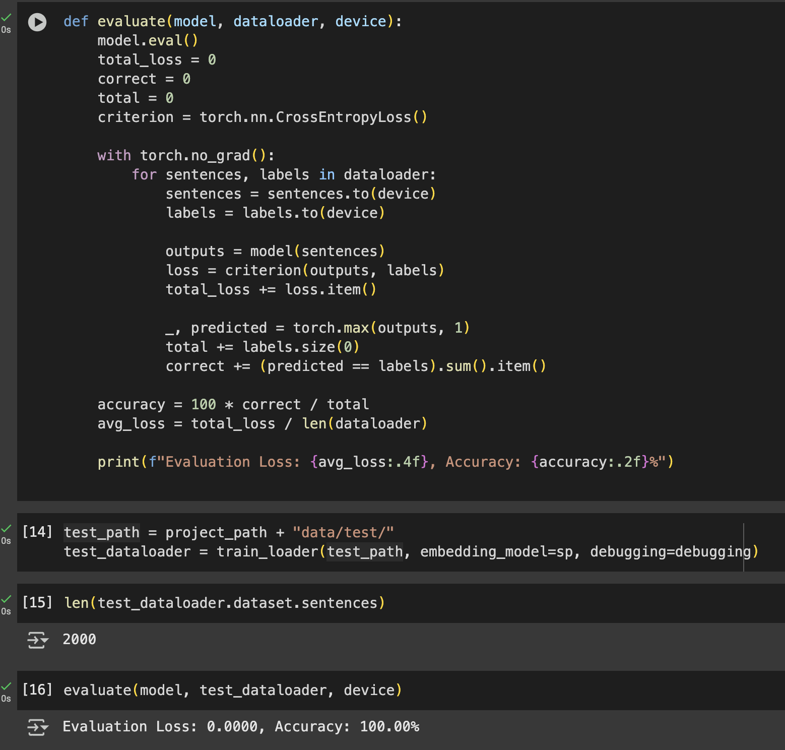
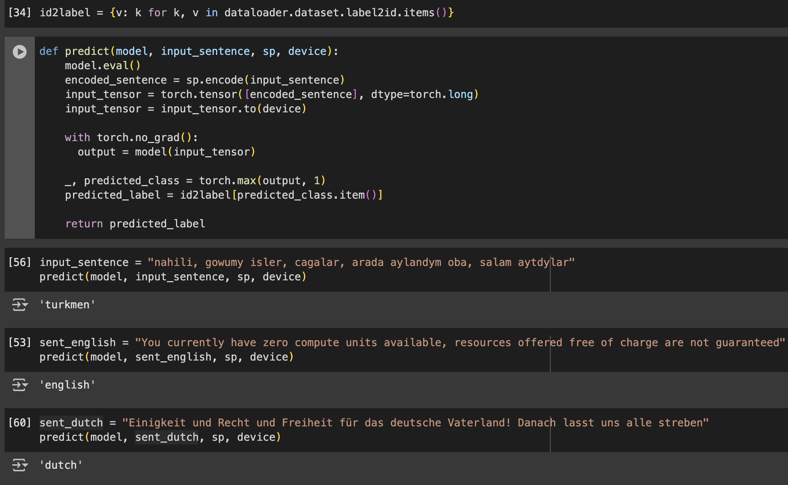

Train custom embedding model if change the training data or vocabulary size: 
```bash
make train_embedding
```
Providing *training data directory* and *vocabulary size* in `Makefile`

This model trained with over 100K sentences of english, dutch, french and turkmen languages. 
Initial model trained with `LSTMModel` class, you try other classes from `models.py`. Evaluated with 2K sentences.




You can experiment with in the [notebook](notebooks/sentence_language_classification.ipynb).



